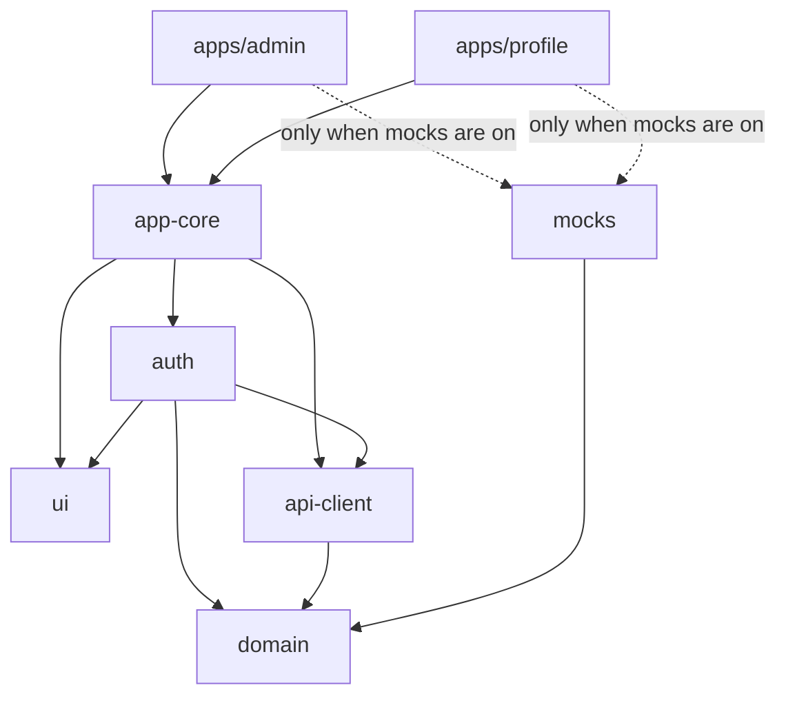

# SaaS Platform: Frontend

The frontend for a SaaS platform with several products. It contains two products:

- **Admin Console** (`apps/admin`): administrators manage users (list, search, filter, details, edit).
- **My Account** (`apps/profile`): every user views and edits their own profile.

Both products share authentication, a design system, an API client and the data models. The focus of this project is the **architecture**: how the code is split, how dependencies flow, and how the codebase grows when new features, products and teams are added.

---

## Quick start

Requirements: **Node 22+** and **pnpm 10**.

```bash
pnpm install
pnpm dev
```

| App           | URL                   | Demo account                        |
| ------------- | --------------------- | ----------------------------------- |
| Admin Console | http://localhost:5173 | `admin@example.com` / `password123` |
| My Account    | http://localhost:5174 | `user@example.com` / `password123`  |

- `user@example.com` can sign in to Admin too, but sees **"Access denied"** (the wrong role).
- **No backend is needed.** A mock API (MSW) runs inside the browser and saves changes in `localStorage`.
- The two apps run on different ports, so locally each app has its own login. In production they would be served from one domain and share the session.

### Scripts

| Command          | What it does                                      |
| ---------------- | ------------------------------------------------- |
| `pnpm dev`       | Start both apps                                   |
| `pnpm build`     | Production build of both apps                     |
| `pnpm test`      | Run all tests (18 tests, Vitest + MSW)            |
| `pnpm typecheck` | TypeScript check of every package                 |
| `pnpm lint`      | ESLint, including the architecture rules          |

Run a task for one project only with a filter: `pnpm --filter @saas/admin dev`.

---

## 1. Architecture

**A monorepo (pnpm workspaces + Turborepo) with feature-based apps and shared packages.**

```
apps/
  admin/          Admin Console
  profile/        My Account
packages/
  domain/         Data models and validation (zod): the single source of truth
  api-client/     HTTP client (axios) with response validation
  mocks/          Mock API (MSW + in-memory database), for development and tests only
  i18n/           Texts setup (react-i18next): every text lives in locale files
  ui/             Design system: MUI theme, app frame, page states, form fields
  auth/           Session, AuthProvider, route guards, login page
  app-core/       Startup code and providers shared by every app
  config/         Shared TypeScript, ESLint and Vitest settings
```

### Dependency direction

Dependencies point **one way only**: from the apps down to the base packages. Shared packages never import apps, and this is checked by ESLint (see [§4](#4-how-the-rules-are-enforced)).



### Inside an app

Every app has the same structure. Each top-level folder has one job:

```
src/
  main.tsx          Entry point: startApp(...)
  App.tsx           Providers + router, and the app's theme color
  config/env.ts     Environment variables, validated with zod at startup
  router/
    router.tsx      All routes: login, guards, layout, error pages
    features.ts     The list of features in this app
  layouts/          The page frame (menu + header) for this app
  hooks/            Hooks shared by several features of this app
  features/         One folder per business feature
  test/             Test helpers
```

A **feature** is a vertical slice that contains everything it needs:

```
features/users/
  index.ts          Public entry point: the only file other code may import
  feature.tsx       The feature's routes and menu items
  pages/            Route components (lazy loaded)
  components/       UI used only by this feature
  hooks/            Feature state (e.g. list filters stored in the URL)
  hooks/api/        One hook per API call + the TanStack Query keys
  locales/en.json   All texts of the feature
```

**Every feature exports a `FeatureModule`** (`{ routes, navItems, translations }`), and **an app is just a list of features**:

```ts
// apps/admin/src/router/features.ts
export const features: FeatureModule[] = [usersFeature];
```

The router, the side menu and the texts are built from this list. **Adding a feature means creating one folder and adding one line.**

---

## 2. Why these choices

### Monorepo instead of separate repositories or micro frontends

The products share a lot: login, API access, data models and the look. The main risk at this size is those shared parts **drifting apart**.

- **In a monorepo**, one pull request can change a shared package and every app that uses it, with one CI run. Internal packages don't need publishing or versioning.
- **Micro frontends** (Module Federation) solve a different problem: many teams that need to **release independently at runtime**. They cost a shell app, shared-dependency version conflicts at runtime and harder debugging. For two products that share most of their code, that cost isn't justified. Each app is **already built and deployed separately**, and the structure keeps the micro-frontend option open (see [§5](#5-how-the-project-grows)).

### Feature-based folders instead of type-based folders

Type-based folders (`pages/users`, `components/users`, `hooks/users`...) spread one feature over many places. With feature folders:

- a feature can be **added, removed or handed to another team as one folder**;
- a team can own a folder;
- each feature has **one public entry point**, so its insides can change safely;
- each page is **lazy loaded**, so the first download stays small as features are added.

Truly shared code stays outside the features: in the app's `hooks/`, or in a package when several apps need it.

### Packages without a build step

Packages expose their TypeScript source directly (`"exports": { ".": "./src/index.ts" }`), and the app's Vite build compiles them. There are no `dist` folders to keep in sync and no watch processes, changes in a package show up instantly in the app, and "go to definition" opens the real source.

### Technology

| Area                 | Choice                               | Why                                                                                                                                                                   |
| -------------------- | ------------------------------------ | --------------------------------------------------------------------------------------------------------------------------------------------------------------------- |
| Build                | **Vite + React 19**                  | Fast development. These are logged-in dashboards (no SEO, no public pages), so server-side rendering (Next.js) would add complexity without real benefit.              |
| Server data          | **TanStack Query**                   | Caching, loading and error states, retries and cache refresh after changes, built in. Almost all "global state" in a dashboard is server data.                        |
| Other state          | **URL + React state + context**      | List filters and pagination live in the URL (they survive a reload and can be shared). The session is a small store. No Redux is needed.                              |
| Routing              | **React Router**                     | Route objects let each feature declare its own lazy routes; `errorElement` catches errors per route.                                                                 |
| Forms and validation | **react-hook-form + zod**            | The **same** zod schema validates the form, checks the API response and is used by the mock API. One definition, no drift.                                          |
| HTTP                 | **axios** behind `@saas/api-client`  | An interceptor adds the token. Every response is checked with its zod schema, and every error becomes one `ApiError` type with a status.                              |
| UI                   | **MUI** behind `@saas/ui`            | Suggested by the brief. Apps get the theme and shared components from one place, so all products look like one family, and each has its own accent color.            |
| Mock API             | **MSW**                              | Mocks at the network level: the app runs its **real** HTTP code, and switching to a real backend is only a setting. The same handlers are used in tests.              |
| Tests                | **Vitest + Testing Library + MSW**   | Integration tests render real routes and providers against the mock API, so they test behavior, not implementation details.                                          |
| Monorepo tooling     | **pnpm workspaces + Turborepo**      | pnpm blocks imports of undeclared dependencies. Turborepo runs tasks in dependency order and skips what didn't change.                                                 |

---

## 3. Key design details

### Authentication

- **The session lives in a small store outside React** (`@saas/auth`): `localStorage` plus a list of listeners.
  - The axios client can read the token and end the session on a 401.
  - React components re-render through `useSyncExternalStore`.
  - **Tabs stay in sync**: signing out in one tab signs out every tab (the browser's `storage` event).
- **The API client doesn't know about auth.** At startup, `startApp` gives it two functions: "how to get the token" and "what to do on a 401". Auth can change without touching the API client.
- **A 401 on any request ends the session.** The guard then sends the user to `/login` and **remembers the page they wanted**; after login, they go back there. A wrong password (also a 401) is handled separately, so it doesn't log anyone out.
- **On startup**, a saved session is checked with `GET /me`, so an expired token or a changed role is noticed.
- **When the session ends, the whole query cache is cleared**, so the next user can never see the previous user's data.
- **Roles:** `<RequireAuth roles={['admin']}>` protects the whole Admin app in one place. **The mock API enforces the same rules (403).** The UI check is only for a good user experience; the server makes it secure.

> **Token storage.** The token is kept in `localStorage` because there's no real backend. In production, the backend should set an **httpOnly, Secure, SameSite cookie**, so JavaScript can never read the token (XSS protection). Only the session store and the startup code would change.

### API layer and server data

- **Every response is checked with its zod schema.** If the backend changes its data shape, the error appears at the boundary with a clear message, not deep inside a component.
- **Errors become one `ApiError` type** (status + message). Forms show them in the right place; for example, a 409 "email already in use" is shown under the email field.
- **One hook per API call** (`useUsersList`, `useUser`, `useUpdateUser`, `useMyProfile`, `useUpdateProfile`). Pages never use TanStack Query directly.
- **Query keys live in the feature** and include the params, so every page and filter has its own cache entry. After an edit, one `invalidateQueries` refreshes every users list.
- **The same `queryOptions` are reused for prefetching:** hovering over a row preloads that user's details.
- **App-wide query settings** (in `app-core`): data is fresh for 30 seconds, and 4xx errors are not retried (retrying a 404 or 403 doesn't help).

### Texts (i18n)

- **No text is written inside components.** Every text lives in a `locales/en.json` file, and components use `t('key')` (react-i18next behind `@saas/i18n`).
- **Each package and each feature owns its texts** as one namespace: `validation` (domain), `ui`, `auth`, `core` (app-core), `app` (each app), and `users` / `profile` (the features). A feature brings its texts through its `FeatureModule`, just like its routes, so **deleting a feature deletes its texts**.
- **The app collects them at startup** (`createAppI18n` in `app-core`): the shared packages' texts + the app's own + every feature's.
- **Validation messages are keys** (for example `'nameTooShort'`) in the zod schemas, and the shared form field translates them. The schemas stay free of UI code.
- **The app is English only for now.** Another language means adding a second locale file next to each `en.json`. For a right-to-left language like Persian, the theme's direction and an RTL style plugin are added in `UiProvider`.

### User experience details that come from the architecture

- List state (page, page size, search, role) is in the URL.
- The search is debounced: one request after typing stops.
- While the next page loads, the current one stays on screen (`keepPreviousData`).
- Every page handles loading, error (with "Try again"), empty and data states, using shared components.
- Errors are caught per route, inside the layout, so a crashing page never removes the navigation.
- The UI mirrors server rules; for example, an admin cannot change their own role, so those fields are disabled with an explanation.

---

## 4. How the rules are enforced

Rules that aren't checked get broken as the team grows. Here, tools check them:

| Rule                                                      | Enforced by                                                   |
| --------------------------------------------------------- | ------------------------------------------------------------- |
| Packages are imported only through their public entry     | ESLint `no-restricted-imports` + `exports` in `package.json`   |
| Features are imported only through their `index.ts`       | ESLint (`@/features/*/*` is not allowed)                       |
| Features don't import other features or the app wiring    | ESLint rule for `src/features/**` (`@/router`, `@/layouts`...) |
| Shared packages never import from apps                    | ESLint rule for `packages/**`                                  |
| A package uses only the dependencies it declares          | pnpm's strict `node_modules`                                   |
| React and MUI exist only once                             | Packages list them as `peerDependencies`                       |
| One version of each shared library in the whole repo      | pnpm `catalog:` in `pnpm-workspace.yaml`                       |
| No lint or type errors are committed                      | Pre-commit hook (husky + lint-staged + typecheck)              |
| Everything passes before it reaches `main`                | CI: GitHub Actions runs lint, typecheck, test and build        |

The pre-commit hook gives fast feedback on the developer's machine, but it can be skipped (`--no-verify`). **CI is the real gate:** `.github/workflows/ci.yml` runs `lint`, `typecheck`, `test` and `build` on every push to `main` and on every pull request, with a frozen lockfile.

---

## 5. How the project grows

### Adding a feature (e.g. "Audit log" in Admin)

1. Create `apps/admin/src/features/audit-log/` with `feature.tsx` (routes, menu item, texts), `locales/en.json` and `index.ts`.
2. Add its API functions to `@saas/api-client` and its schemas to `@saas/domain`.
3. Add one line to `apps/admin/src/router/features.ts`.

The router, the menu, the texts and the lazy loading follow automatically, and no other feature changes.

### Adding a product (e.g. "Billing")

Copy the small app skeleton (outside its feature, `apps/profile` is about a dozen small files), change the name, port and color, and build its features. Login, guards, layout, theme, API client, mocks, startup and tooling **already work**. The Profile app is the proof: almost all of its code is its own feature.

### Where shared code goes

Code starts **local** and moves up only when a second user appears:

```
used by one feature    → inside that feature
used by two features   → the app's hooks/ (or components/, utils/)
used by two apps       → a package
```

`DemoCredentials` is an example: it started in the Admin app and moved to `@saas/ui` when the Profile app needed it too. Domain-specific UI shared by several products (e.g. a `UserPicker`) would go into its own package, so `@saas/ui` stays free of business logic.

### Adding teams

- **Ownership by folder:** each team owns its apps or feature folders (for example with a GitHub `CODEOWNERS` file), and a platform team owns `packages/*`. Changes to a shared package need its owners' review.
- **Fast CI as the repo grows:** Turborepo runs tasks only for what changed (`turbo run test --filter=...[origin/main]`). Remote caching lets CI and developers share results.
- **Stable contracts:** packages and features expose only their `index.ts`, so their insides can be refactored freely. Changes to a public API are reviewed by everyone who uses it.
- **The same start for everyone:** every developer gets the same checks on commit, and every app starts the same way through `app-core`.

### Moving to micro frontends, if it's ever needed

Only if these become real problems: **many teams that need independent release schedules**, or one app too large to build and deploy as a unit. The path is gradual, because the boundary already exists: a feature folder exports a `FeatureModule` (`routes` + `navItems`), which is exactly what a Module Federation "remote" would expose to a host app.

### Next steps for production

- **Real backend:** set `VITE_ENABLE_MOCKS=false` and `VITE_API_URL`. Generate the domain types from the backend's OpenAPI spec; the zod checks stay as a runtime safety net.
- **Session:** httpOnly cookie, short-lived tokens with refresh.
- **One domain for all products** (`/admin`, `/profile`) behind a reverse proxy, so they share one login.
- **A second language** (e.g. Persian): add `locales/fa.json` files next to the English ones, a language switch, and right-to-left support in `UiProvider`.
- **More quality tools:** end-to-end tests (Playwright) for the main flows, Storybook for `@saas/ui`, error monitoring (e.g. Sentry) in `startApp`, and a shared Prettier config.
